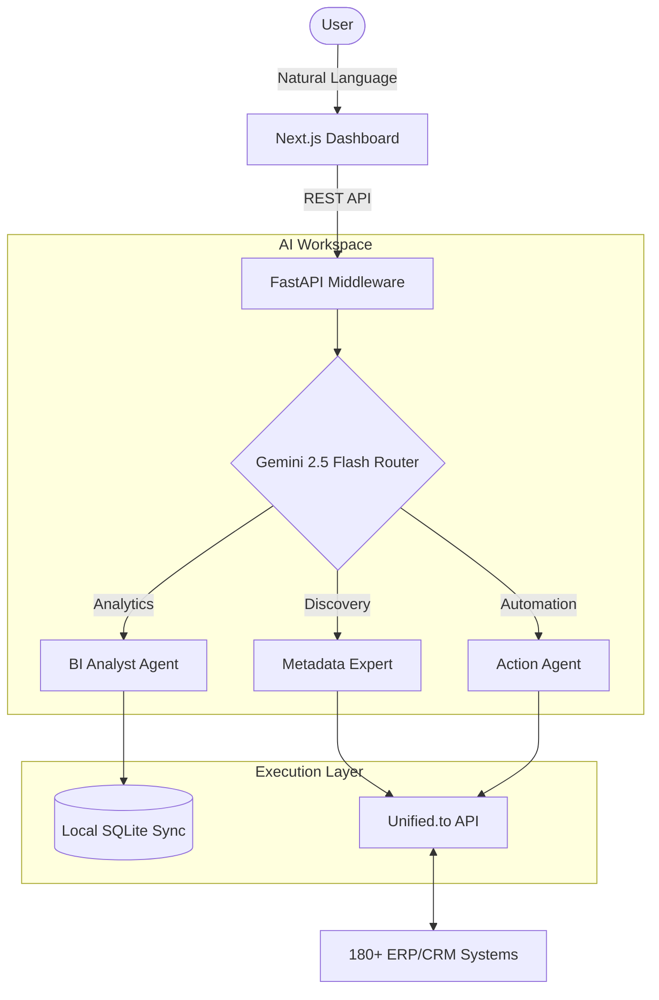

# 🤖 Erpy-Middleware: The Agentic ERP Interface

**Erpy-Middleware** is a high-performance agentic bridge providing a natural language interface to 180+ ERP and CRM systems.

[](https://unified.to)

## 🎯 Problem & Solution
Modern businesses are trapped in software silos—HubSpot for leads, QuickBooks for finance, NetSuite for ERP. Moving data between them requires complex manual entry or fragile, hard-coded integrations.

**Erpy-Middleware** solves this by inserting an intelligent reasoning layer between the user and their software. Using **Gemini 2.5 Pro** and **Unified.to**, it understands human intent and executes cross-platform actions autonomously, essentially turning any legacy CRM/ERP into a conversational partner.

---

## 🏗 Architecture & Data Flow



---

## 🚀 Core Features & Workflows

### 1. Automated Lead & Contact Management
*   **Workflow**: Use natural language to create, update, or retrieve contacts across multiple CRMs.
*   **Example**: *"Create a new contact in HubSpot for Jane Doe (jane@acme.com) and set her status to 'Qualified Lead'."*
*   **Outcome**: The Automation Agent maps the request to the HubSpot schema and executes the API call via Unified.to.

### 2. Intelligent Data Discovery & Mapping
*   **Workflow**: Automatically analyze raw API metadata from any connected system to discover custom fields.
*   **Example**: *"Identify all custom fields in our NetSuite environment related to project costs."*
*   **Outcome**: The Discovery Expert analyzes the universal schema and provides a human-readable mapping strategy.

### 3. Native BI Chat (Local Analytics)
*   **Workflow**: Chat directly with synced data (Customers, Products, Invoices).
*   **Example**: *"Who is our top-spending customer this month?"* or *"Summarize the last 5 unpaid invoices."*
*   **Outcome**: The Analyst Agent queries the local synchronized database to provide instant insights without extra API calls.

---

## 💬 Example User Prompts & Actions

| User Prompt | Classified Intent | System Action |
| :--- | :--- | :--- |
| "Show me a summary of our total revenue." | **ANALYTICS** | Queries local `invoices` table and summarizes. |
| "What fields are available in my Salesforce connection?" | **DISCOVERY** | Fetches metadata from Unified.to and maps schema. |
| "Update the email for John Smith to js@new.com in HubSpot." | **AUTOMATION** | Formats payload and PATCHES the record via Unified.to. |
| "Create a new product 'Quantum Widget' with price 500." | **AUTOMATION** | Creates record in the connected Accounting ERP. |

---

## 🛠 Tech Stack

-   **Frontend**: Next.js 14, React, TailwindCSS/Vanilla CSS (UX-focused responsive design).
-   **Backend**: FastAPI (Python), Pydantic-AI (Agent orchestration).
-   **AI Core**: Google Gemini 2.5 Flash (Routing/BI) & Gemini 2.5 Pro (Reasoning/Discovery).
-   **Platform**: [Unified.to](https://unified.to/) for universal data access.

---

## ⚙️ Environment & Configuration

Create a `.env` file in the `backend/` directory with the following variables:

| Variable | Description | Source |
| :--- | :--- | :--- |
| `GEMINI_API_KEY` | Google AI Studio Key | [AI Studio](https://aistudio.google.com/) |
| `UNIFIED_API_KEY` | Unified.to API Key | [Unified.to Dashboard](https://unified.to/) |
| `DATABASE_URL` | Local SQLite path | Default: `sqlite:///./app/dummy.db` |

---

## 🛡 Security & Assumptions
*   **Data Privacy**: All AI reasoning is performed using the user's provided API keys. Data remains in the local database or transit via Unified.to.
*   **Prototype State**: This is currently an **MVP/Prototype**. The agents are highly capable but assume "Standard Objects" are mapped via Unified.to.
*   **Rate Limits**: Performance is subject to Gemini API and Unified.to rate limits.

---

## 🗺 Roadmap
- [ ] **Phase 1**: Real-time Webhooks for instant sync between disparate ERPs.
- [ ] **Phase 2**: Multi-step "Workflows" (e.g., "If an invoice is paid in QuickBooks, email the contact in Salesforce").
- [ ] **Phase 3**: Support for "Custom Documents" and native file attachments (Gemini Multimodal).
- [ ] **Phase 4**: Enterprise SSO and Role-Based Access Control (RBAC).

---

## 🚦 Getting Started

### Prerequisites
- Python 3.10+
- Node.js 18+

### Quickstart

1.  **Clone & Backend Setup**
    ```bash
    git clone https://github.com/Jawknee-builds/Erpy-Middleware.git
    cd Erpy-Middleware/backend
    pip install -r requirements.txt
    python -m uvicorn app.main:app --reload
    ```

2.  **Frontend Setup**
    ```bash
    cd ../frontend
    npm install
    npm run dev
    ```

---
Built with 🤖 and ❤️ by Jawknee-builds
