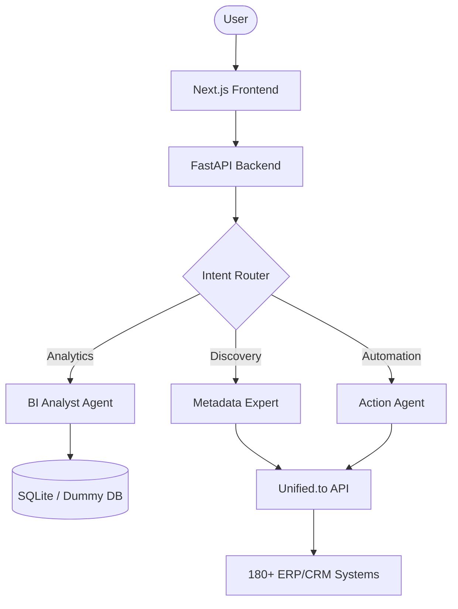

# 🤖 Erpy-Middleware: The Agentic ERP Interface

Erpy-Middleware is a state-of-the-art agentic platform that provides a natural language interface to 180+ ERP and CRM systems. Built with **FastAPI**, **Next.js**, and **Gemini 2.5**, it enables users to analyze, discover, and automate their data across fragmented software silos.

## 🌟 Key Features

### 🚀 Multi-Agent Ecosystem
- **Smart Intent Router**: Powered by **Gemini 2.5 Flash**, it instantly classifies user requests and directs them to the perfect sub-agent.
- **Automation Execution Agent**: A reasoning-heavy **Gemini 2.5 Pro** agent that performs real-world actions like creating contacts in HubSpot or updating invoices in QuickBooks.
- **Business Analyst**: Talk directly to your data. Ask questions like *"Who is my top customer?"* or *"What was our total revenue last month?"* and get instant answers from your local synced data.
- **ERP Discovery Expert**: Automatically analyzes raw API metadata from any connected system to map complex fields to standard schemas.

### 🔗 Universal Connectivity
- **Unified.to Integration**: Access HubSpot, Salesforce, QuickBooks, NetSuite, and 180+ other tools through a single, unified API.
- **Native Passthrough**: For edge cases where standard schemas aren't enough, the agent can make raw, native API calls directly to the vendor's endpoint.

### 📊 Modern Dashboard
- **Live Data Streams**: View synchronized tables of Customers, Products, and Invoices.
- **Intelligent Chat**: A seamless chat interface to interact with your agentic tools while viewing your business data.

## 🏗 Architecture



## 🛠 Tech Stack

- **Frontend**: [Next.js](https://nextjs.org/), React, Vanilla CSS (Premium Designs)
- **Backend**: [FastAPI](https://fastapi.tiangolo.com/), Pydantic-AI
- **AI Engine**: [Google Gemini 2.5 Flash & Pro](https://ai.google.dev/)
- **Integration Layer**: [Unified.to](https://unified.to/)

## 🚦 Getting Started

### Prerequisites
- Python 3.10+
- Node.js 18+
- [Unified.to](https://unified.to/) API Key
- [Google AI Studio](https://aistudio.google.com/) API Key (for Gemini)

### Installation

1. **Clone the Repo**
   ```bash
   git clone https://github.com/Jawknee-builds/ERP-chat-bot-
   cd ERP-chat-bot-
   ```

2. **Backend Setup**
   ```bash
   cd backend
   python -m venv venv
   source venv/bin/activate
   pip install -r requirements.txt
   # Setup your .env with GEMINI_API_KEY and UNIFIED_API_KEY
   uvicorn app.main:app --reload
   ```

3. **Frontend Setup**
   ```bash
   cd ../frontend
   npm install
   npm run dev
   ```

## 📜 License
MIT License. See `LICENSE` for details.

---
Built with ❤️ by Jawknee-builds
